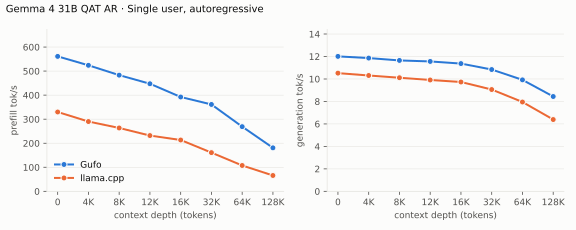
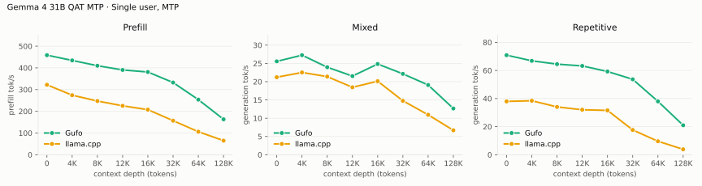
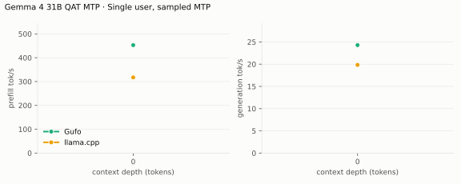
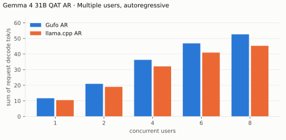
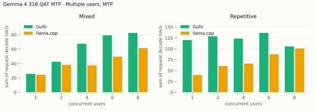
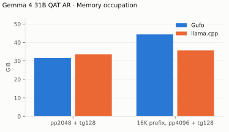

# Gemma 4 31B QAT benchmarks

AMD Strix Halo `gfx1151`, 128 GB unified memory. Unsloth
`gemma-4-31B-it-qat-UD-Q4_K_XL` target (every projection Q4_0) and its Q4_0
QAT `gemma4-assistant` MTP drafter. Gufo drafts up to seven tokens under its
confidence-based length control (`--draft-policy confidence`, the default when these tables were measured; the calibrated default is compared in [EXPERIMENTS.md](../gemma-4-31b/EXPERIMENTS.md)); llama.cpp drafts up to four. HTTP, greedy,
thinking off. llama.cpp is the repository's pinned `b11069` (ROCm) reference.
Positive gain favors Gufo. **TODO** means unmeasured.
[Quality and measurement details](QUALITY.md#benchmark-method) · [Model identities](artifacts/model-identities.json)

## Single user, autoregressive

Approximately pp2048 / tg128; depth is the cached prefix in tokens.

<!-- bench:single-ar -->
| Gemma 4 31B QAT AR Depth (tokens) | Gufo pp (tok/s) | llama.cpp pp (tok/s) | Gain | Gufo tg (tok/s) | llama.cpp tg (tok/s) | Gain |
| ---: | ---: | ---: | ---: | ---: | ---: | ---: |
| 0 | 461.82 | 329.96 | +40.0% | 11.68 | 10.52 | +11.0% |
| 4,096 | 422.11 | 290.26 | +45.4% | 11.50 | 10.31 | +11.5% |
| 8,192 | 395.04 | 263.49 | +49.9% | 11.35 | 10.11 | +12.3% |
| 12,288 | 383.61 | 231.95 | +65.4% | 11.27 | 9.91 | +13.7% |
| 16,384 | 370.75 | 213.47 | +73.7% | 11.11 | 9.73 | +14.2% |
| 32,768 | 313.52 | 160.99 | +94.7% | 10.61 | 9.06 | +17.1% |
| 65,536 | 241.87 | 107.53 | +124.9% | 9.75 | 7.95 | +22.6% |
| 131,072 | 166.28 | 65.93 | +152.2% | 8.36 | 6.39 | +30.8% |
<!-- /bench -->

## Single user, MTP

pp is the highest measured rate per engine and depth across mixed/repetitive
text.
Greedy texts differ between the engines, so accepted drafts per cycle differ
per depth (artifacts); llama.cpp's repetitive acceptance collapses past 32K.

<!-- bench:single-mtp -->
| Gemma 4 31B QAT MTP Depth (tokens) | Gufo pp (tok/s) | llama.cpp pp (tok/s) | Gain pp | Gufo tg mixed (tok/s) | llama.cpp tg mixed (tok/s) | Gain mixed | Gufo tg repetitive (tok/s) | llama.cpp tg repetitive (tok/s) | Gain repetitive |
| ---: | ---: | ---: | ---: | ---: | ---: | ---: | ---: | ---: | ---: |
| 0 | 456.96 | 322.01 | +41.9% | 23.93 | 21.22 | +12.8% | 68.98 | 37.97 | +81.7% |
| 4,096 | 430.74 | 274.16 | +57.1% | 24.17 | 22.52 | +7.3% | 63.74 | 38.44 | +65.8% |
| 8,192 | 402.48 | 247.28 | +62.8% | 22.84 | 21.39 | +6.8% | 63.29 | 34.04 | +85.9% |
| 12,288 | 382.50 | 225.34 | +69.7% | 20.85 | 18.46 | +12.9% | 61.35 | 32.02 | +91.6% |
| 16,384 | 371.08 | 207.50 | +78.8% | 21.97 | 20.13 | +9.1% | 54.90 | 31.57 | +73.9% |
| 32,768 | 319.98 | 156.96 | +103.9% | 20.81 | 14.76 | +41.0% | 52.40 | 17.62 | +197.4% |
| 65,536 | 242.98 | 106.01 | +129.2% | 17.49 | 10.94 | +59.9% | 37.26 | 9.60 | +288.1% |
| 131,072 | 166.56 | 64.90 | +156.6% | 11.95 | 6.69 | +78.6% | 20.14 | 3.85 | +423.1% |
<!-- /bench -->

## Single user, sampled MTP

Temperature 1, top-k 64, top-p 0.95, repeat penalty 1.05; a story-writing turn
after the cached prefix. Mean of three requests with seeds 1–3. At 0–4K
Gufo's cycle is cheaper (105–109 vs 114–122 ms) but its confidence floor
proposes 2.4 drafts per cycle against llama.cpp's fixed four, so it accepts
fewer per cycle (1.0–1.3 vs 1.5); the floor was tuned on the standard 31B's
Q8_0 drafter. The 4K gap is within one standard deviation.

<!-- bench:single-mtp-sampled -->
| Gemma 4 31B QAT MTP Depth (tokens) | Gufo pp (tok/s) | llama.cpp pp (tok/s) | Gain | Gufo tg (tok/s) | llama.cpp tg (tok/s) | Gain |
| ---: | ---: | ---: | ---: | ---: | ---: | ---: |
| 0 | 454.99 ± 3.97 | 313.73 ± 2.00 | +45.0% | 21.77 ± 0.21 | 21.79 ± 0.63 | -0.1% |
| 4,096 | 430.74 ± 3.67 | 271.96 ± 1.15 | +58.4% | 18.53 ± 1.11 | 20.13 ± 1.58 | -7.9% |
| 16,384 | 368.06 ± 2.12 | 206.89 ± 1.04 | +77.9% | 19.60 ± 1.07 | 15.75 ± 0.70 | +24.4% |
| 32,768 | 315.49 ± 1.17 | 156.73 ± 0.12 | +101.3% | 17.72 ± 1.06 | 13.40 ± 1.27 | +32.2% |
| 65,536 | 240.38 ± 2.21 | 106.06 ± 0.09 | +126.6% | 17.43 ± 1.51 | 9.77 ± 0.54 | +78.4% |
<!-- /bench -->

## Multiple users, autoregressive

Same pp2048 prose prompt as single-user d0, tg128, context 4096 per user.
All sessions prefilled before timed decoding; throughput sums individual rates.

<!-- bench:multi-ar -->
| Gemma 4 31B QAT AR Users | Gufo AR (tok/s) | llama.cpp AR (tok/s) | Gain |
| ---: | ---: | ---: | ---: |
| 1 | 11.68 | 10.50 | +11.2% |
| 2 | 20.92 | 18.99 | +10.2% |
| 4 | 36.29 | 32.10 | +13.1% |
| 6 | 46.86 | 40.95 | +14.4% |
| 8 | 52.67 | 45.30 | +16.3% |
<!-- /bench -->

## Multiple users, MTP

Same pp2048 mixed/repetitive prompts as single-user d0, tg128, context 4096
per user. All sessions prefilled before timed decoding; rates sum individual
request decode rates. As on the standard 31B, Gufo verifies all sessions'
drafts in one forward of at most 16 exact rows (16 / users − 1 drafts per
session), while llama.cpp verifies up to four drafts per user with
Q8_1-activation matrix kernels that scale further with rows.

<!-- bench:multi-mtp -->
| Gemma 4 31B QAT MTP Users | Gufo mixed (tok/s) | llama.cpp mixed (tok/s) | Gain | Gufo repetitive (tok/s) | llama.cpp repetitive (tok/s) | Gain |
| ---: | ---: | ---: | ---: | ---: | ---: | ---: |
| 1 | 23.96 | 24.36 | -1.6% | 68.54 | 39.61 | +73.0% |
| 2 | 34.18 | 38.18 | -10.5% | 77.78 | 60.58 | +28.4% |
| 4 | 45.85 | 37.44 | +22.5% | 68.54 | 66.07 | +3.7% |
| 6 | 53.90 | 49.68 | +8.5% | 59.95 | 87.51 | -31.5% |
| 8 | 56.13 | 61.50 | -8.7% | 62.77 | 100.93 | -37.8% |
<!-- /bench -->

## Loading time

C1, capacity 262144, MTP. Cold model files to HTTP readiness.

<!-- bench:loading -->
| Gemma 4 31B QAT Target | Gufo ready (s) | llama.cpp ready (s) | Gain |
| --- | ---: | ---: | ---: |
| QAT | 3.86 | 6.46 | +67.4% |
<!-- /bench -->

## Memory occupation

Capacity 133121 tokens, AR. Both engines allocate KV for the whole capacity;
device total minus free on this unified-memory APU.

<!-- bench:memory -->
| Gemma 4 31B QAT AR Workload | Gufo GiB | llama.cpp GiB | Gain |
| --- | ---: | ---: | ---: |
| pp2048 + tg128 | 31.38 | 33.54 | +6.9% |
| 16K prefix, pp4096 + tg128 | 34.31 | 35.71 | +4.1% |
<!-- /bench -->

