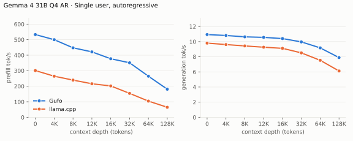
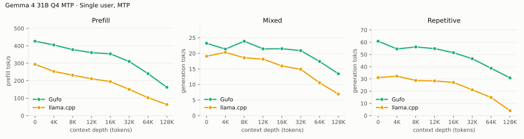
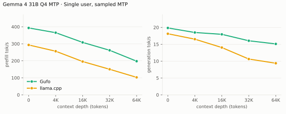
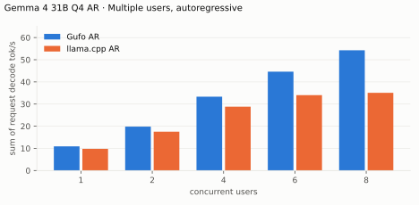
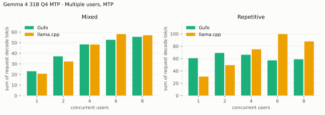
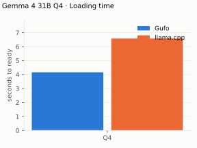
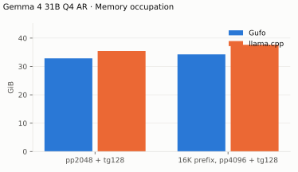

# Gemma 4 31B benchmarks

AMD Strix Halo `gfx1151`, 128 GB unified memory. Unsloth `UD-Q4_K_XL` target
and its `gemma4-assistant` Q8_0 MTP drafter. Gufo drafts up to seven tokens
under its confidence-based length control (`--draft-policy confidence`, the default when these tables were measured; the calibrated default is compared in [EXPERIMENTS.md](../gemma-4-31b/EXPERIMENTS.md)); llama.cpp drafts up to four.
HTTP, greedy, thinking off. llama.cpp is the repository's pinned `b11069`
(ROCm) reference for AR and MTP.
Positive gain favors Gufo. **TODO** means unmeasured.
[Quality and measurement details](QUALITY.md#benchmark-method) · [Model identities](artifacts/model-identities.json)

## Single user, autoregressive

Approximately pp2048 / tg128; depth is the cached prefix in tokens.

<!-- bench:single-ar -->
| Gemma 4 31B Q4 AR Depth (tokens) | Gufo pp (tok/s) | llama.cpp pp (tok/s) | Gain | Gufo tg (tok/s) | llama.cpp tg (tok/s) | Gain |
| ---: | ---: | ---: | ---: | ---: | ---: | ---: |
| 0 | 427.05 | 300.91 | +41.9% | 10.73 | 9.80 | +9.5% |
| 4,096 | 390.56 | 264.62 | +47.6% | 10.60 | 9.61 | +10.3% |
| 8,192 | 368.90 | 239.48 | +54.0% | 10.46 | 9.43 | +10.9% |
| 12,288 | 345.49 | 215.96 | +60.0% | 10.37 | 9.26 | +12.0% |
| 16,384 | 343.90 | 202.00 | +70.2% | 10.24 | 9.11 | +12.4% |
| 32,768 | 294.07 | 154.12 | +90.8% | 9.81 | 8.51 | +15.3% |
| 65,536 | 225.69 | 104.28 | +116.4% | 9.07 | 7.53 | +20.5% |
| 131,072 | 156.09 | 64.56 | +141.8% | 7.84 | 6.12 | +28.1% |
<!-- /bench -->

## Single user, MTP

pp is the highest measured rate per engine and depth across mixed/repetitive
text.

<!-- bench:single-mtp -->
| Gemma 4 31B Q4 MTP Depth (tokens) | Gufo pp (tok/s) | llama.cpp pp (tok/s) | Gain pp | Gufo tg mixed (tok/s) | llama.cpp tg mixed (tok/s) | Gain mixed | Gufo tg repetitive (tok/s) | llama.cpp tg repetitive (tok/s) | Gain repetitive |
| ---: | ---: | ---: | ---: | ---: | ---: | ---: | ---: | ---: | ---: |
| 0 | 420.58 | 294.20 | +43.0% | 23.19 | 19.08 | +21.5% | 59.51 | 31.11 | +91.3% |
| 4,096 | 397.33 | 253.33 | +56.8% | 23.49 | 20.32 | +15.6% | 53.70 | 32.28 | +66.4% |
| 8,192 | 373.91 | 231.63 | +61.4% | 22.25 | 18.58 | +19.8% | 55.08 | 28.74 | +91.6% |
| 12,288 | 356.43 | 211.21 | +68.8% | 21.53 | 18.14 | +18.7% | 53.72 | 28.37 | +89.4% |
| 16,384 | 347.03 | 195.22 | +77.8% | 21.65 | 15.95 | +35.7% | 49.73 | 27.19 | +82.9% |
| 32,768 | 303.82 | 150.59 | +101.8% | 21.00 | 14.89 | +41.0% | 45.09 | 21.08 | +113.9% |
| 65,536 | 231.72 | 102.73 | +125.6% | 15.83 | 10.56 | +49.9% | 38.27 | 14.85 | +157.7% |
| 131,072 | 161.18 | 63.79 | +152.7% | 12.73 | 6.92 | +84.0% | 30.77 | 4.09 | +652.3% |
<!-- /bench -->

## Single user, sampled MTP

The sampler of a typical chat front end: temperature 1, top-k 64, top-p 0.95,
repeat penalty 1.05; a story-writing turn after the cached prefix (the prefix
turn itself is greedy). Mean of three requests with seeds 1–3; sampled text
differs between engines and runs, so acceptance varies more than in the
greedy tables.

<!-- bench:single-mtp-sampled -->
| Gemma 4 31B Q4 MTP Depth (tokens) | Gufo pp (tok/s) | llama.cpp pp (tok/s) | Gain | Gufo tg (tok/s) | llama.cpp tg (tok/s) | Gain |
| ---: | ---: | ---: | ---: | ---: | ---: | ---: |
| 0 | 419.66 ± 3.43 | 293.21 ± 0.96 | +43.1% | 19.71 ± 0.76 | 18.12 ± 1.97 | +8.8% |
| 4,096 | 398.27 ± 3.61 | 256.40 ± 2.11 | +55.3% | 20.49 ± 1.44 | 16.51 ± 0.64 | +24.1% |
| 16,384 | 343.57 ± 1.76 | 195.75 ± 1.13 | +75.5% | 18.30 ± 0.76 | 14.03 ± 1.35 | +30.4% |
| 32,768 | 297.39 ± 1.88 | 150.21 ± 0.25 | +98.0% | 16.89 ± 0.85 | 10.62 ± 0.56 | +59.0% |
| 65,536 | 231.60 ± 0.79 | 102.75 ± 0.08 | +125.4% | 15.24 ± 1.30 | 9.37 ± 0.88 | +62.6% |
<!-- /bench -->

## Multiple users, autoregressive

Same pp2048 prose prompt as single-user d0, tg128, context 4096 per user.
All sessions prefilled before timed decoding; throughput sums individual rates.
Gufo decodes up to eight sessions in one forward: row-wise work runs once for
all of them, attention per session. Every session reads its own sliding-window
cache (16 MB per layer), about a fifth of an eight-user step.

<!-- bench:multi-ar -->
| Gemma 4 31B Q4 AR Users | Gufo AR (tok/s) | llama.cpp AR (tok/s) | Gain |
| ---: | ---: | ---: | ---: |
| 1 | 10.71 | 9.79 | +9.4% |
| 2 | 19.44 | 17.54 | +10.8% |
| 4 | 32.73 | 28.83 | +13.5% |
| 6 | 43.81 | 34.03 | +28.7% |
| 8 | 47.01 | 35.08 | +34.0% |
<!-- /bench -->

## Multiple users, MTP

Same pp2048 mixed/repetitive prompts as single-user d0, tg128, context 4096
per user. All sessions prefilled before timed decoding; rates sum individual
request decode rates. C1 cross-checks the single-user table. Gufo verifies all
sessions' drafts in one forward of at most 16 rows (16 / users − 1 drafts per
session), which keeps each row's arithmetic equal to its own session's decode;
llama.cpp verifies up to 4 drafts per user with Q8_1-activation matrix kernels,
which scale further with rows. Gufo's lead from AR does not carry past two
users.

<!-- bench:multi-mtp -->
| Gemma 4 31B Q4 MTP Users | Gufo mixed (tok/s) | llama.cpp mixed (tok/s) | Gain | Gufo repetitive (tok/s) | llama.cpp repetitive (tok/s) | Gain |
| ---: | ---: | ---: | ---: | ---: | ---: | ---: |
| 1 | 23.27 | 20.73 | +12.3% | 59.68 | 30.93 | +93.0% |
| 2 | 30.80 | 32.25 | -4.5% | 68.28 | 49.44 | +38.1% |
| 4 | 39.00 | 48.28 | -19.2% | 63.44 | 75.05 | -15.5% |
| 6 | 48.04 | 58.11 | -17.3% | 53.60 | 99.65 | -46.2% |
| 8 | 50.13 | 57.05 | -12.1% | 55.58 | 87.82 | -36.7% |
<!-- /bench -->

## Image requests

Single user, AR, context 16384. Each image was resized once to a
multiple of 48 so both servers encode identical pixels into the same soft
tokens: Gufo at `--image-tokens 280` or `1120`, llama.cpp with its default
70–1120 range. llama.cpp needs `-b 2048 -ub 2048` here: with the default
512-token ubatch it aborts on 1,107-token images (non-causal image batches
must fit one ubatch). Cold: a fresh nonce precedes the image, so nothing is
reused; follow-up: the next user turn, reusing the image prefix. Median of
three warmed requests, 64 output tokens, greedy
([Gufo 280](artifacts/image-gufo-280.json), [Gufo 1120](artifacts/image-gufo-1120.json),
[llama.cpp](artifacts/image-reference.json); `tools/gemma4/image_bench.py`).

| Image | Budget | Prompt tokens | Gufo cold TTFT (s) | llama.cpp cold TTFT (s) | Gain | Gufo follow-up TTFT (s) | llama.cpp follow-up TTFT (s) | Gain | Gufo tg (tok/s) | llama.cpp tg (tok/s) | Gain |
| --- | ---: | ---: | ---: | ---: | ---: | ---: | ---: | ---: | ---: | ---: | ---: |
| Chart 624×960 | 280 | 313 | 1.26 | 1.92 | +52.6% | 0.40 | 0.70 | +73.2% | 11.19 | 9.90 | +13.0% |
| Logo 768×768 | 280 | 309 | 1.33 | 1.85 | +38.5% | 0.43 | 0.72 | +68.0% | 11.19 | 9.54 | +17.3% |
| Chart 1296×1968 | 1120 | 1161 | 4.46 | 8.34 | +87.1% | 0.48 | 1.04 | +118.2% | 10.81 | 8.27 | +30.7% |
| Logo 1584×1584 | 1120 | 1141 | 4.22 | 8.35 | +98.0% | 0.49 | 1.10 | +124.2% | 10.81 | 7.96 | +35.8% |

Gain is llama.cpp time over Gufo time minus one (decode: Gufo over
llama.cpp). Gufo's vision encoder takes 164 ms for 260 soft tokens and
1,025 ms for 1,107; the rest of a cold request is ordinary prefill.

## gemma-control fork (single user)

The previous production setup: halo-box/strix-llama.cpp `8c1c282ec` on Vulkan
RADV with `GGML_VK_MMV_NO_SPLIT=1 -b 2048 -ub 512`, same GGUF files, same
driver workloads and four draft tokens (Gufo up to seven). Hand-rendered from
[artifacts/fork](artifacts/fork). At 128K with MTP its Vulkan queue timed out
(`Fence fallback timer expired on ring comp_1.1.0`); its repetitive MTP
workload was not run.

Greedy MTP texts differ between the engines, so accepted drafts per cycle
differ per depth; Gufo drafts up to seven tokens under its confidence-based
length control, the fork a fixed four. Gufo's cycle (draft plus verify) is
shorter at every measured depth: 117 vs 120 ms at d0, 118 vs 126 ms at 4K,
132 vs 165 ms at 32K and 159 vs 211 ms at 64K.

| Gemma 4 31B Q4 AR Depth (tokens) | Gufo pp (tok/s) | fork pp (tok/s) | Gain | Gufo tg (tok/s) | fork tg (tok/s) | Gain |
| ---: | ---: | ---: | ---: | ---: | ---: | ---: |
| 0 | 427.05 | 293.92 | +45.3% | 10.73 | 10.53 | +1.9% |
| 4,096 | 390.56 | 259.83 | +50.3% | 10.60 | 10.29 | +3.0% |
| 8,192 | 368.90 | 243.79 | +51.3% | 10.46 | 10.01 | +4.5% |
| 12,288 | 345.49 | 220.65 | +56.6% | 10.37 | 9.87 | +5.1% |
| 16,384 | 343.90 | 211.76 | +62.4% | 10.24 | 9.58 | +6.9% |
| 32,768 | 294.07 | 164.54 | +78.7% | 9.81 | 8.93 | +9.9% |
| 65,536 | 225.69 | 117.97 | +91.3% | 9.07 | 7.74 | +17.2% |
| 131,072 | 156.09 | 74.00 | +110.9% | 7.84 | 6.10 | +28.5% |

---

| Gemma 4 31B Q4 MTP mixed Depth (tokens) | Gufo pp (tok/s) | fork pp (tok/s) | Gain | Gufo tg (tok/s) | fork tg (tok/s) | Gain | Gufo / fork accepted per cycle |
| ---: | ---: | ---: | ---: | ---: | ---: | ---: | ---: |
| 0 | 418.34 | 286.71 | +45.9% | 23.19 | 21.71 | +6.8% | 1.72 / 1.61 |
| 4,096 | 394.89 | 253.75 | +55.6% | 23.49 | 23.17 | +1.4% | 1.78 / 1.91 |
| 8,192 | 373.51 | 234.69 | +59.2% | 22.25 | 20.84 | +6.8% | 1.67 / 1.78 |
| 12,288 | 356.43 | 216.64 | +64.5% | 21.53 | 17.49 | +23.1% | 1.61 / 1.37 |
| 16,384 | 347.03 | 201.12 | +72.5% | 21.65 | 19.42 | +11.5% | 1.72 / 1.72 |
| 32,768 | 298.45 | 159.66 | +86.9% | 21.00 | 16.47 | +27.5% | 1.78 / 1.72 |
| 65,536 | 229.88 | 114.11 | +101.5% | 15.83 | 12.67 | +24.9% | 1.51 / 1.67 |
| 131,072 | 161.09 | N/A | N/A | 12.73 | N/A | N/A | 1.51 / N/A |

## Loading time

C1, capacity 262144, MTP. Cold model files to HTTP readiness.

<!-- bench:loading -->
| Gemma 4 31B Q4 Target | Gufo ready (s) | llama.cpp ready (s) | Gain |
| --- | ---: | ---: | ---: |
| Q4 | 4.41 | 6.58 | +49.2% |
<!-- /bench -->

## Memory occupation

Capacity 133121 tokens, AR. Both engines allocate KV for the whole capacity,
so the footprint barely grows with the prefix. The counter is device total
minus free, which on this unified-memory APU tracks system-wide use; both
engines were measured on September 27 from the same 3.0 GiB idle baseline.
Gufo's global layers store V and only the rotated key dims (50 KiB per
token instead of 80).

<!-- bench:memory -->
| Gemma 4 31B Q4 AR Workload | Gufo GiB | llama.cpp GiB | Gain |
| --- | ---: | ---: | ---: |
| pp2048 + tg128 | 32.87 | 35.47 | +7.9% |
| 16K prefix, pp4096 + tg128 | 34.26 | 37.64 | +9.9% |
<!-- /bench -->

