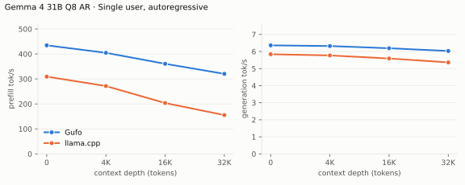
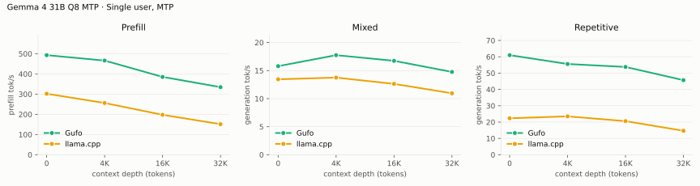
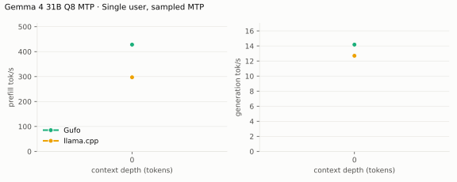
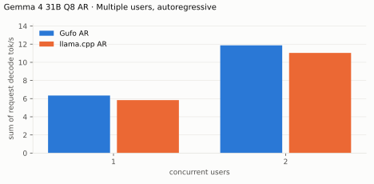
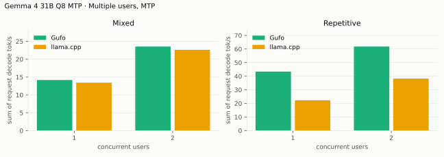
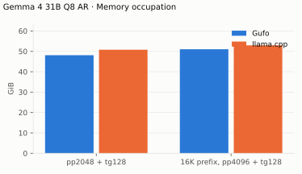

# Gemma 4 31B benchmarks

AMD Strix Halo `gfx1151`, 128 GB unified memory. Unsloth `UD-Q4_K_XL` and
`UD-Q8_K_XL` targets and their `gemma4-assistant` Q8_0 MTP drafter. Gufo
drafts up to 15 tokens under its calibrated length control, verifying the
drafter's runner-up beside each draft; llama.cpp drafts up to four. The Q8
tables are a reduced grid (depths to 32K, up to two users). Gufo columns
measured October 5, 2026; llama.cpp columns September 26–30.
HTTP, greedy, thinking off. llama.cpp is the repository's pinned `b11069`
(ROCm) reference for AR and MTP.
Positive gain favors Gufo. **TODO** means unmeasured.
[Quality and measurement details](QUALITY.md#benchmark-method) · [Model identities](artifacts/model-identities.json)

## Single user, autoregressive

Approximately pp2048 / tg128; depth is the cached prefix in tokens.

<!-- bench:single-ar -->
| Gemma 4 31B Q4 AR Depth (tokens) | Gufo pp (tok/s) | llama.cpp pp (tok/s) | Gain | Gufo tg (tok/s) | llama.cpp tg (tok/s) | Gain |
| ---: | ---: | ---: | ---: | ---: | ---: | ---: |
| 0 | 532.75 | 300.91 | +77.0% | 10.93 | 9.80 | +11.5% |
| 4,096 | 499.77 | 264.62 | +88.9% | 10.81 | 9.61 | +12.5% |
| 8,192 | 447.37 | 239.48 | +86.8% | 10.63 | 9.43 | +12.7% |
| 12,288 | 421.30 | 215.96 | +95.1% | 10.56 | 9.26 | +14.0% |
| 16,384 | 377.02 | 202.00 | +86.6% | 10.40 | 9.11 | +14.2% |
| 32,768 | 351.07 | 154.12 | +127.8% | 9.96 | 8.51 | +17.0% |
| 65,536 | 264.65 | 104.28 | +153.8% | 9.17 | 7.53 | +21.8% |
| 131,072 | 180.90 | 64.56 | +180.2% | 7.89 | 6.12 | +28.9% |
<!-- /bench -->

---

<!-- bench:single-ar-q8 -->
| Gemma 4 31B Q8 AR Depth (tokens) | Gufo pp (tok/s) | llama.cpp pp (tok/s) | Gain | Gufo tg (tok/s) | llama.cpp tg (tok/s) | Gain |
| ---: | ---: | ---: | ---: | ---: | ---: | ---: |
| 0 | 495.47 | 309.27 | +60.2% | 6.34 | 5.84 | +8.6% |
| 4,096 | 466.16 | 271.60 | +71.6% | 6.30 | 5.77 | +9.2% |
| 16,384 | 385.88 | 203.60 | +89.5% | 6.16 | 5.59 | +10.2% |
| 32,768 | 336.79 | 155.38 | +116.8% | 6.00 | 5.36 | +11.9% |
<!-- /bench -->

## Single user, MTP

pp is the highest measured rate per engine and depth across mixed/repetitive
text.

<!-- bench:single-mtp -->
| Gemma 4 31B Q4 MTP Depth (tokens) | Gufo pp (tok/s) | llama.cpp pp (tok/s) | Gain pp | Gufo tg mixed (tok/s) | llama.cpp tg mixed (tok/s) | Gain mixed | Gufo tg repetitive (tok/s) | llama.cpp tg repetitive (tok/s) | Gain repetitive |
| ---: | ---: | ---: | ---: | ---: | ---: | ---: | ---: | ---: | ---: |
| 0 | 536.56 | 294.20 | +82.4% | 26.28 | 19.08 | +37.7% | 112.32 | 31.11 | +261.0% |
| 4,096 | 501.40 | 253.33 | +97.9% | 23.81 | 20.32 | +17.2% | 103.96 | 32.28 | +222.1% |
| 8,192 | 449.22 | 231.63 | +93.9% | 23.71 | 18.58 | +27.6% | 109.82 | 28.74 | +282.1% |
| 12,288 | 420.32 | 211.21 | +99.0% | 23.85 | 18.14 | +31.5% | 96.96 | 28.37 | +241.8% |
| 16,384 | 412.16 | 195.22 | +111.1% | 22.65 | 15.95 | +42.0% | 82.36 | 27.19 | +202.9% |
| 32,768 | 349.52 | 150.59 | +132.1% | 20.68 | 14.89 | +38.9% | 79.83 | 21.08 | +278.7% |
| 65,536 | 260.29 | 102.73 | +153.4% | 17.68 | 10.56 | +67.4% | 59.49 | 14.85 | +300.6% |
| 131,072 | 173.28 | 63.79 | +171.6% | 13.15 | 6.92 | +90.0% | 43.76 | 4.09 | +969.9% |
<!-- /bench -->

---

<!-- bench:single-mtp-q8 -->
| Gemma 4 31B Q8 MTP Depth (tokens) | Gufo pp (tok/s) | llama.cpp pp (tok/s) | Gain pp | Gufo tg mixed (tok/s) | llama.cpp tg mixed (tok/s) | Gain mixed | Gufo tg repetitive (tok/s) | llama.cpp tg repetitive (tok/s) | Gain repetitive |
| ---: | ---: | ---: | ---: | ---: | ---: | ---: | ---: | ---: | ---: |
| 0 | 493.02 | 301.96 | +63.3% | 15.79 | 13.45 | +17.4% | 61.00 | 22.34 | +173.1% |
| 4,096 | 466.16 | 256.10 | +82.0% | 17.75 | 13.75 | +29.1% | 55.59 | 23.52 | +136.4% |
| 16,384 | 385.32 | 197.65 | +95.0% | 16.74 | 12.63 | +32.5% | 53.78 | 20.58 | +161.3% |
| 32,768 | 334.70 | 151.24 | +121.3% | 14.76 | 10.95 | +34.8% | 45.68 | 14.68 | +211.2% |
<!-- /bench -->

## Single user, sampled MTP

The sampler of a typical chat front end: temperature 1, top-k 64, top-p 0.95,
repeat penalty 1.05; a story-writing turn after the cached prefix (the prefix
turn itself is greedy). Mean of five requests with seeds 1–5; sampled text
differs between engines and runs, so acceptance varies more than in the
greedy tables.

<!-- bench:single-mtp-sampled -->
| Gemma 4 31B Q4 MTP Depth (tokens) | Gufo pp (tok/s) | llama.cpp pp (tok/s) | Gain | Gufo tg (tok/s) | llama.cpp tg (tok/s) | Gain |
| ---: | ---: | ---: | ---: | ---: | ---: | ---: |
| 0 | 518.04 ± 25.91 | 291.19 ± 2.26 | +77.9% | 22.30 ± 1.05 | 17.77 ± 1.56 | +25.5% |
<!-- /bench -->

---

<!-- bench:single-mtp-sampled-q8 -->
| Gemma 4 31B Q8 MTP Depth (tokens) | Gufo pp (tok/s) | llama.cpp pp (tok/s) | Gain | Gufo tg (tok/s) | llama.cpp tg (tok/s) | Gain |
| ---: | ---: | ---: | ---: | ---: | ---: | ---: |
| 0 | 478.97 ± 22.74 | 294.38 ± 2.39 | +62.7% | 14.66 ± 1.47 | 12.28 ± 0.77 | +19.4% |
<!-- /bench -->

## Multiple users, autoregressive

Same pp2048 prose prompt as single-user d0, tg128, context 4096 per user.
All sessions prefilled before timed decoding; throughput sums individual rates.
Gufo decodes up to eight sessions in one forward: row-wise work runs once for
all of them, attention per session. Every session reads its own sliding-window
cache (16 MB per layer), about a fifth of an eight-user step.

<!-- bench:multi-ar -->
| Gemma 4 31B Q4 AR Users | Gufo AR (tok/s) | llama.cpp AR (tok/s) | Gain |
| ---: | ---: | ---: | ---: |
| 1 | 10.93 | 9.79 | +11.6% |
| 2 | 19.81 | 17.54 | +12.9% |
| 4 | 33.34 | 28.83 | +15.6% |
| 6 | 44.61 | 34.03 | +31.1% |
| 8 | 54.28 | 35.08 | +54.7% |
<!-- /bench -->

---

<!-- bench:multi-ar-q8 -->
| Gemma 4 31B Q8 AR Users | Gufo AR (tok/s) | llama.cpp AR (tok/s) | Gain |
| ---: | ---: | ---: | ---: |
| 1 | 6.34 | 5.84 | +8.6% |
| 2 | 11.87 | 11.04 | +7.5% |
<!-- /bench -->

## Multiple users, MTP

Same pp2048 mixed/repetitive prompts as single-user d0, tg128, context 4096
per user. All sessions prefilled before timed decoding; rates sum individual
request decode rates. C1 cross-checks the single-user table. Gufo verifies all
sessions' drafts in one forward of at most 16 rows (16 / users − 1 drafts per
session), which keeps each row's arithmetic equal to its own session's decode;
llama.cpp verifies up to 4 drafts per user with Q8_1-activation matrix kernels,
which scale further with rows. Gufo's lead from AR does not carry past two
users.

<!-- bench:multi-mtp -->
| Gemma 4 31B Q4 MTP Users | Gufo mixed (tok/s) | llama.cpp mixed (tok/s) | Gain | Gufo repetitive (tok/s) | llama.cpp repetitive (tok/s) | Gain |
| ---: | ---: | ---: | ---: | ---: | ---: | ---: |
| 1 | 25.72 | 20.73 | +24.1% | 110.92 | 30.93 | +258.6% |
| 2 | 42.58 | 32.25 | +32.0% | 119.70 | 49.44 | +142.1% |
| 4 | 65.53 | 48.28 | +35.7% | 114.61 | 75.05 | +52.7% |
| 6 | 77.91 | 58.11 | +34.1% | 124.67 | 99.65 | +25.1% |
| 8 | 79.35 | 57.05 | +39.1% | 98.82 | 87.82 | +12.5% |
<!-- /bench -->

---

<!-- bench:multi-mtp-q8 -->
| Gemma 4 31B Q8 MTP Users | Gufo mixed (tok/s) | llama.cpp mixed (tok/s) | Gain | Gufo repetitive (tok/s) | llama.cpp repetitive (tok/s) | Gain |
| ---: | ---: | ---: | ---: | ---: | ---: | ---: |
| 1 | 15.40 | 13.43 | +14.7% | 60.94 | 22.28 | +173.5% |
| 2 | 25.44 | 22.62 | +12.5% | 63.71 | 38.23 | +66.6% |
<!-- /bench -->

## MTP draft policy

`--draft-policy calibrated` became the default on September 28, 2026; the MTP
tables above use it. Relative A/B of the two policies on one development
build (`gpu-test` preset), two runs each in ABBA order with one server per
run; greedy texts are identical under both policies, sampled texts differ
because draft counts change the random draws. Depth is a shared earlier
conversation turn reused from the prompt cache.
[d0](artifacts/draft-policy-ab-d0k.json) · [8K](artifacts/draft-policy-ab-d8k.json) ·
`tools/gemma4/draft_policy_bench.py`

| Gemma 4 31B Q4 MTP Workload | d0 confidence (tok/s) | d0 calibrated (tok/s) | Gain | 8K confidence (tok/s) | 8K calibrated (tok/s) | Gain |
| --- | ---: | ---: | ---: | ---: | ---: | ---: |
| Prose, greedy (12 prompts) | 22.81 | 23.05 | +1.0% | 20.90 | 21.39 | +2.4% |
| Story, temperature 1 (12 seeds) | 19.87 | 20.02 | +0.8% | 19.49 | 19.24 | -1.3% |
| Code writing, greedy | 35.28 | 36.16 | +2.5% | 30.09 | 31.15 | +3.5% |
| Code writing, temperature 0.6 (12 seeds) | 27.82 | 28.00 | +0.7% | 25.79 | 26.03 | +0.9% |
| Code edit in context, greedy | 54.50 | 54.38 | -0.2% | 52.76 | 51.94 | -1.5% |
| Repetitive, greedy | 57.38 | 57.03 | -0.6% | 55.27 | 55.06 | -0.4% |

Prose and new code gain; verbatim copying is within about 1.5%. Per-run
values and draft counts are in the artifacts.

## Image requests

Single user, AR, context 16384. Each image was resized once to a
multiple of 48 so both servers encode identical pixels into the same soft
tokens: Gufo at `--image-tokens 280` or `1120`, llama.cpp with its default
70–1120 range. llama.cpp needs `-b 2048 -ub 2048` here: with the default
512-token ubatch it aborts on 1,107-token images (non-causal image batches
must fit one ubatch). Cold: a fresh nonce precedes the image, so nothing is
reused; follow-up: the next user turn, reusing the image prefix. Median of
three warmed requests, 64 output tokens, greedy
([Gufo 280](artifacts/image-gufo-280.json), [Gufo 1120](artifacts/image-gufo-1120.json),
[llama.cpp](artifacts/image-reference.json); `tools/gemma4/image_bench.py`).

| Image | Budget | Prompt tokens | Gufo cold TTFT (s) | llama.cpp cold TTFT (s) | Gain | Gufo follow-up TTFT (s) | llama.cpp follow-up TTFT (s) | Gain | Gufo tg (tok/s) | llama.cpp tg (tok/s) | Gain |
| --- | ---: | ---: | ---: | ---: | ---: | ---: | ---: | ---: | ---: | ---: | ---: |
| Chart 624×960 | 280 | 312 | 1.32 | 1.92 | +45.5% | 0.41 | 0.70 | +68.4% | 11.43 | 9.90 | +15.5% |
| Logo 768×768 | 280 | 309 | 1.30 | 1.85 | +42.4% | 0.41 | 0.72 | +75.9% | 11.43 | 9.54 | +19.8% |
| Chart 1296×1968 | 1120 | 1160 | 4.57 | 8.34 | +82.4% | 0.47 | 1.04 | +121.8% | 11.05 | 8.27 | +33.6% |
| Logo 1584×1584 | 1120 | 1140 | 4.34 | 8.35 | +92.4% | 0.48 | 1.10 | +126.3% | 11.04 | 7.96 | +38.7% |

Gain is llama.cpp time over Gufo time minus one (decode: Gufo over
llama.cpp). Gufo's vision encoder takes 162 ms for 260 soft tokens and
1,147 ms for 1,107; the rest of a cold request is ordinary prefill.

## Vulkan llama.cpp fork (single user)

A third-party baseline: the Strix Halo llama.cpp fork halo-box/strix-llama.cpp
`8c1c282ec` on Vulkan RADV with `GGML_VK_MMV_NO_SPLIT=1 -b 2048 -ub 512`, same
GGUF files, same driver workloads and four draft tokens (Gufo up to seven).
Hand-rendered from
[artifacts/fork](artifacts/fork); the Gufo cells here are from the
September 26 run (revision b3a13bc), not the refreshed tables above. At 128K with MTP its Vulkan queue timed out
(`Fence fallback timer expired on ring comp_1.1.0`); its repetitive MTP
workload was not run.

Greedy MTP texts differ between the engines, so accepted drafts per cycle
differ per depth; Gufo drafts up to seven tokens under its confidence-based
length control, the fork a fixed four. Gufo's cycle (draft plus verify) is
shorter at every measured depth: 117 vs 120 ms at d0, 118 vs 126 ms at 4K,
132 vs 165 ms at 32K and 159 vs 211 ms at 64K.

| Gemma 4 31B Q4 AR Depth (tokens) | Gufo pp (tok/s) | fork pp (tok/s) | Gain | Gufo tg (tok/s) | fork tg (tok/s) | Gain |
| ---: | ---: | ---: | ---: | ---: | ---: | ---: |
| 0 | 427.05 | 293.92 | +45.3% | 10.73 | 10.53 | +1.9% |
| 4,096 | 390.56 | 259.83 | +50.3% | 10.60 | 10.29 | +3.0% |
| 8,192 | 368.90 | 243.79 | +51.3% | 10.46 | 10.01 | +4.5% |
| 12,288 | 345.49 | 220.65 | +56.6% | 10.37 | 9.87 | +5.1% |
| 16,384 | 343.90 | 211.76 | +62.4% | 10.24 | 9.58 | +6.9% |
| 32,768 | 294.07 | 164.54 | +78.7% | 9.81 | 8.93 | +9.9% |
| 65,536 | 225.69 | 117.97 | +91.3% | 9.07 | 7.74 | +17.2% |
| 131,072 | 156.09 | 74.00 | +110.9% | 7.84 | 6.10 | +28.5% |

---

\* Gufo cells measured with the previous `--draft-policy confidence` default; see [MTP draft policy](#mtp-draft-policy) for the calibrated default at d0 and 8K.

| Gemma 4 31B Q4 MTP mixed Depth (tokens) | Gufo pp (tok/s) | fork pp (tok/s) | Gain | Gufo tg (tok/s) | fork tg (tok/s) | Gain | Gufo / fork accepted per cycle |
| ---: | ---: | ---: | ---: | ---: | ---: | ---: | ---: |
| 0 | 418.34 | 286.71 | +45.9% | 23.19 | 21.71 | +6.8% | 1.72 / 1.61 |
| 4,096 | 394.89 | 253.75 | +55.6% | 23.49 | 23.17 | +1.4% | 1.78 / 1.91 |
| 8,192 | 373.51 | 234.69 | +59.2% | 22.25 | 20.84 | +6.8% | 1.67 / 1.78 |
| 12,288 | 356.43 | 216.64 | +64.5% | 21.53 | 17.49 | +23.1% | 1.61 / 1.37 |
| 16,384 | 347.03 | 201.12 | +72.5% | 21.65 | 19.42 | +11.5% | 1.72 / 1.72 |
| 32,768 | 298.45 | 159.66 | +86.9% | 21.00 | 16.47 | +27.5% | 1.78 / 1.72 |
| 65,536 | 229.88 | 114.11 | +101.5% | 15.83 | 12.67 | +24.9% | 1.51 / 1.67 |
| 131,072 | 161.09 | N/A | N/A | 12.73 | N/A | N/A | 1.51 / N/A |

## Loading time

C1, capacity 262144, MTP. Cold model files to HTTP readiness.

<!-- bench:loading -->
| Gemma 4 31B Target | Gufo ready (s) | llama.cpp ready (s) | Gain |
| --- | ---: | ---: | ---: |
| Q4 | 4.31 | 6.58 | +52.7% |
| Q8 | 7.14 | 10.27 | +43.8% |
<!-- /bench -->

## Memory occupation

Capacity 133121 tokens, AR. Both engines allocate KV for the whole capacity.
The counter is device total minus free, which on this unified-memory APU
tracks system-wide use; Gufo (October 5) and llama.cpp (September 27) start
from the same 3.0 GiB idle baseline. Gufo's figure includes its prompt cache:
after the cold 16K prefix it holds about 14 GB of snapshots (a checkpoint
every 2,048 tokens of a cold prompt, the stable conversation boundary and the
complete prompt), bounded by the snapshot cache and released under memory
pressure. llama.cpp runs with `--cache-ram 0`.
Gufo's global layers store V and only the rotated key dims (50 KiB per
token instead of 80).

<!-- bench:memory -->
| Gemma 4 31B Q4 AR Workload | Gufo GiB | llama.cpp GiB | Gain |
| --- | ---: | ---: | ---: |
| pp2048 + tg128 | 33.05 | 35.47 | +7.3% |
| 16K prefix, pp4096 + tg128 | 45.82 | 37.64 | -17.9% |
<!-- /bench -->

---

<!-- bench:memory-q8 -->
| Gemma 4 31B Q8 AR Workload | Gufo GiB | llama.cpp GiB | Gain |
| --- | ---: | ---: | ---: |
| pp2048 + tg128 | 48.12 | 50.79 | +5.5% |
| 16K prefix, pp4096 + tg128 | 60.89 | 52.96 | -13.0% |
<!-- /bench -->

